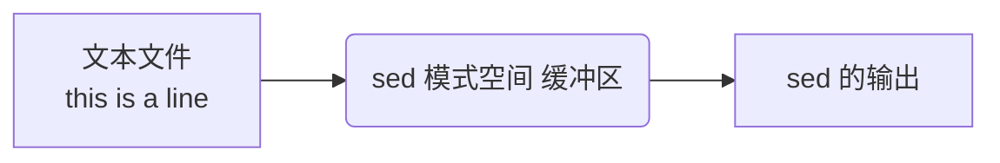

### sed 命令

#### sed 工作流程
流编辑器sed：不需要与人进行交互，修改文件是重点


sed是一种在线的，非交互式的编辑器，它一次处理一行内容。处理时，把当前处理的行存储在临时缓冲区中。称之为模式空间pattern space。接着用sed命令处理缓冲区中的内容，处理完成后，把缓冲区的内容送往屏幕。接着处理下一行，这样不断重复，直到文件末尾。文件内容并没有改变，除非你使用重定向存储输出。

sed主要用来自动编辑一个或多个文件；简化对文件的反复操作；编写转换程序。

#### 格式命令
```shell
sed [options] 'command' file(s)
sed [options] -f scriptfile file(s)
# 注意：
# sed和grep不一样，不管是否找到指定的模式，它的退出状态都是0
# 只有当命令存在语法错误时，sed的退出状态才是非0

sed -ri bak
sed -ric --follow-symlinks
```

#### 支持正则表达式
（1）与grep一样，sed在文件中查找模式时，也可以使用正则表达式RE和各种元字符。
（2）正则表达式是括在斜杠间的模式，用于查找和替换 ，以下是sed支持的元字符
（3）使用基本元字符集：^ ，$, .，*，[],[^]，\ <\ >，\ (\ )，{ \ }
（4）使用扩展元字符集：？，+，{ }，|，( )
（5）使用扩展元字符的方式：\\+，sed -r

#### 基本用法
**参数**
- -r: 正则表达式支持扩展元字符
- -i: 编辑后的结果修改至源文件
- -n: 静默模式，不输出除了p命令外的结果

**命令**
- p 打印
- d 删除
- /match/cmd 查找包含match的行后执行cmd命令
  - 查找范围不一定要使用 "/" 进行包含，可以使用容易字符进行包含，但该字符需要先转译，例如 `\#match#`
- s/origin/sub/ 将查找到的 origin 替换为 sub，origin 支持正则表达式
  - g 行内全局替换，例如`s/origin/sub/g`
  - 和上面一样，不一定需要使用 "/" 进行包含，例如 `s#origin#sub#` 无需转译